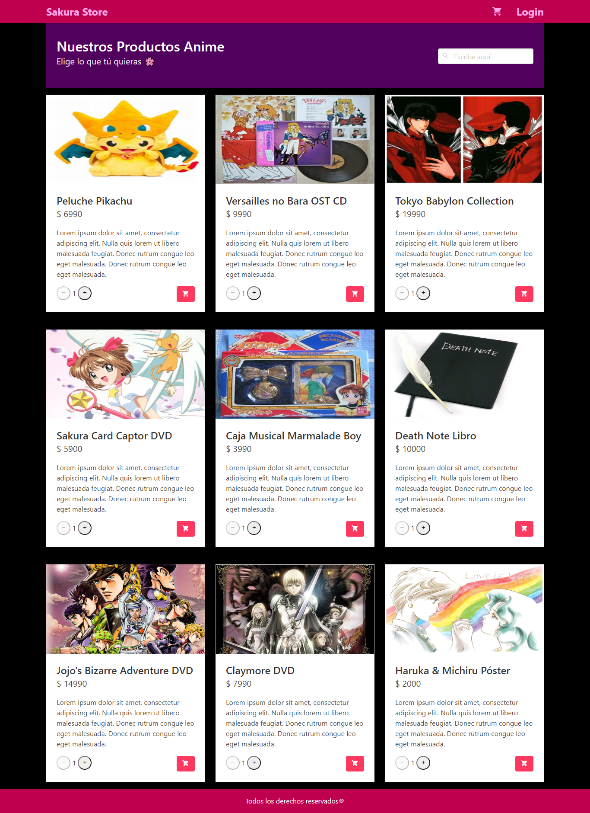

# Sakura Store

## Project Description

This work is about a page that sells japanese animation products. Its functionality is based on **Vue.js**, along with other components such as **Vue Router, VUEX, Testing E2E, Firebase, and CSS style framework called Bulma.**

To see other projects, you can go to the link https://github.com/Marifuse

_Keywords: Vue, Vue Router, VUEX, Testing, Firebase, Framework, Bulma, CSS, JavaScript, HTML, Git, Repository._

## Page View



## Steps to run the Project

## Project setup
```
npm install
```

### Compiles and hot-reloads for development
```
npm run serve
```

### Compiles and minifies for production
```
npm run build
```

### Run your tests
```
npm run test
```

### Lints and fixes files
```
npm run lint
```

### Run your end-to-end tests
```
npm run test:e2e
```

### Run your unit tests
```
npm run test:unit
```

## Link Deploy Hosting

[Sakura Store](https://tddg3-b2b86.web.app).

### Customize configuration
See [Configuration Reference](https://cli.vuejs.org/config/).

## Author

**_María Jesús Fuenzalida S_**
